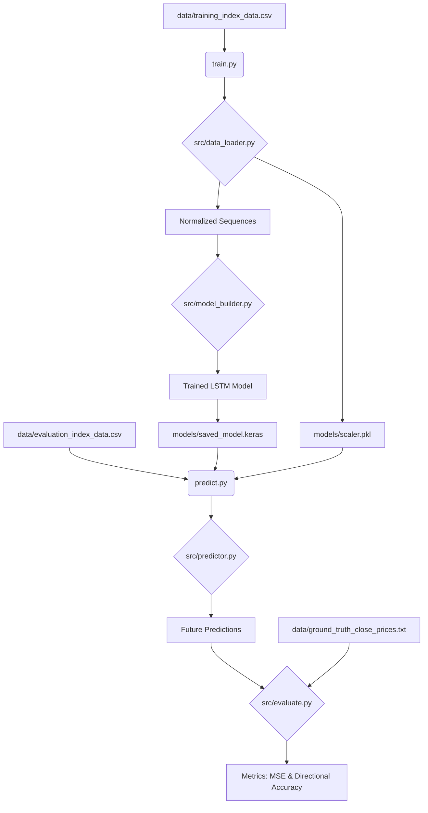

# Project Architecture: Stock Market Index Prediction

This document provides a detailed overview of the system architecture, data flow, and component responsibilities for the Market Index Prediction project.

## 🏗️ System Overview

The project is designed as a modular machine learning pipeline built with Python and TensorFlow. It follows a structured approach to time-series forecasting, utilizing a Long Short-Term Memory (LSTM) neural network to predict future stock index closing prices based on historical trends.

## 📂 Component Architecture

The codebase is organized into several key modules, each adhering to the Single Responsibility Principle:

### 1. Data Processing Layer (`src/data_loader.py`)
*   **Responsibility:** Handling raw data ingestion and preparation.
*   **Key Functions:**
    *   `load_and_clean_data`: Reads CSV files and handles missing values using forward fill (`ffill`) to maintain temporal continuity.
    *   `preprocess_training_data`: Orchestrates the transformation of raw prices into normalized sequences. It uses `MinMaxScaler` (range 0-1) and creates sliding window sequences (default length: 10) for supervised learning.

### 2. Model Development Layer (`src/model_builder.py`)
*   **Responsibility:** Defining and training the neural network architecture.
*   **Architecture Details:**
    *   **Type:** Sequential LSTM.
    *   **Layers:** 
        *   LSTM Layer 1 (50 units, returns sequences).
        *   LSTM Layer 2 (50 units).
        *   Dense Layer (1 unit) for final price prediction.
    *   **Compilation:** Optimized via `Adam` with `Mean Squared Error (MSE)` as the loss function.

### 3. Inference & Prediction Layer (`src/predictor.py`)
*   **Responsibility:** Generating future price estimates using the trained model.
*   **Logic:** Implements an **autoregressive** approach. It takes the most recent sequence, predicts the next step, appends that prediction to the sequence, and repeats for the desired number of future steps. It also handles the inverse transformation of scaled values back to human-readable prices.

### 4. Evaluation Layer (`src/evaluate.py`)
*   **Responsibility:** Measuring model performance against ground truth.
*   **Metrics:**
    *   **Mean Squared Error (MSE):** Quantifies the variance between predicted and actual values.
    *   **Directional Accuracy:** Calculates the percentage of times the model correctly predicted whether the market would move up or down compared to the previous step.

## 🔄 Data Flow

## 🚀 Execution Workflow

1.  **Training Phase (`train.py`):**
    *   Loads historical data from `data/training_index_data.csv`.
    *   Preprocesses and scales data.
    *   Builds and trains the LSTM model for 100 epochs.
    *   Serializes the trained model and the fitted scaler to the `models/` directory for persistence.

2.  **Evaluation Phase (`predict.py`):**
    *   Loads the serialized model and scaler.
    *   Loads unseen evaluation sequences from `data/evaluation_index_data.csv`.
    *   Generates multi-step predictions autoregressively.
    *   Compares predictions against ground truth in `data/ground_truth_close_prices.txt`.
    *   Outputs statistical performance metrics.
