# Project Architecture: Stock Market Index Prediction

This document describes the full system architecture, component responsibilities, data flow, and neural network design for the Market Index Prediction project.

## System Overview

A modular Python + TensorFlow pipeline for multivariate time-series forecasting of stock index closing prices. It uses a stacked LSTM network trained on OHLCV data and technical indicators (SMA, EMA, RSI), with separate training and evaluation entry points.

**Stack:** Python 3.13 · NumPy · Pandas · scikit-learn · TensorFlow/Keras · uv

---

## 1. High-Level System Architecture

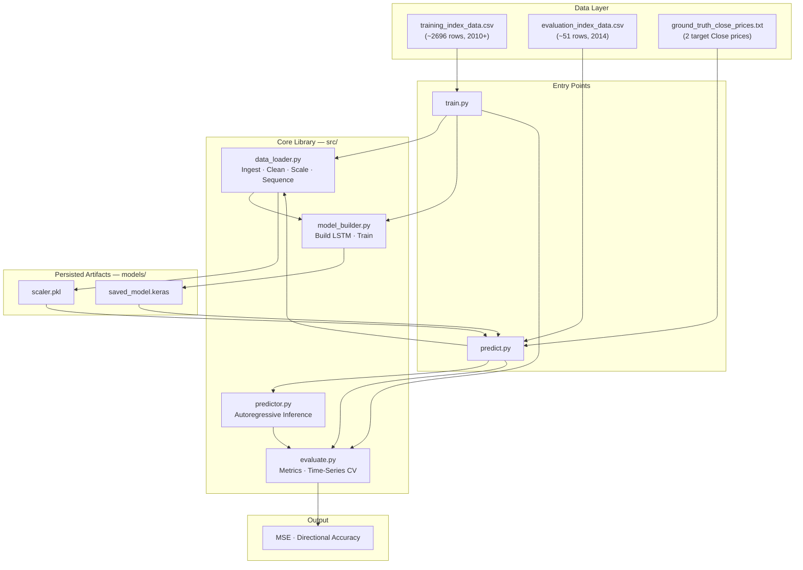
```mermaid
flowchart TB
    subgraph DATA["Data Layer"]
        TRAIN_CSV["training_index_data.csv<br/>(~2696 rows, 2010+)"]
        EVAL_CSV["evaluation_index_data.csv<br/>(~51 rows, 2014)"]
        GT["ground_truth_close_prices.txt<br/>(2 target Close prices)"]
    end

    subgraph ENTRY["Entry Points"]
        TRAIN_PY["train.py"]
        PREDICT_PY["predict.py"]
    end

    subgraph CORE["Core Library — src/"]
        DL["data_loader.py<br/>Ingest · Clean · Scale · Sequence"]
        MB["model_builder.py<br/>Build LSTM · Train"]
        PR["predictor.py<br/>Autoregressive Inference"]
        EV["evaluate.py<br/>Metrics · Time-Series CV"]
    end

    subgraph ARTIFACTS["Persisted Artifacts — models/"]
        MODEL["saved_model.keras"]
        SCALER["scaler.pkl"]
    end

    subgraph OUTPUT["Output"]
        METRICS["MSE · Directional Accuracy"]
    end

    TRAIN_CSV --> TRAIN_PY
    EVAL_CSV --> PREDICT_PY
    GT --> PREDICT_PY

    TRAIN_PY --> DL
    TRAIN_PY --> MB
    TRAIN_PY --> EV

    PREDICT_PY --> DL
    PREDICT_PY --> PR
    PREDICT_PY --> EV

    DL --> MB
    MB --> MODEL
    DL --> SCALER

    MODEL --> PREDICT_PY
    SCALER --> PREDICT_PY
    PR --> EV
    EV --> METRICS
```

---

## 2. Repository Structure

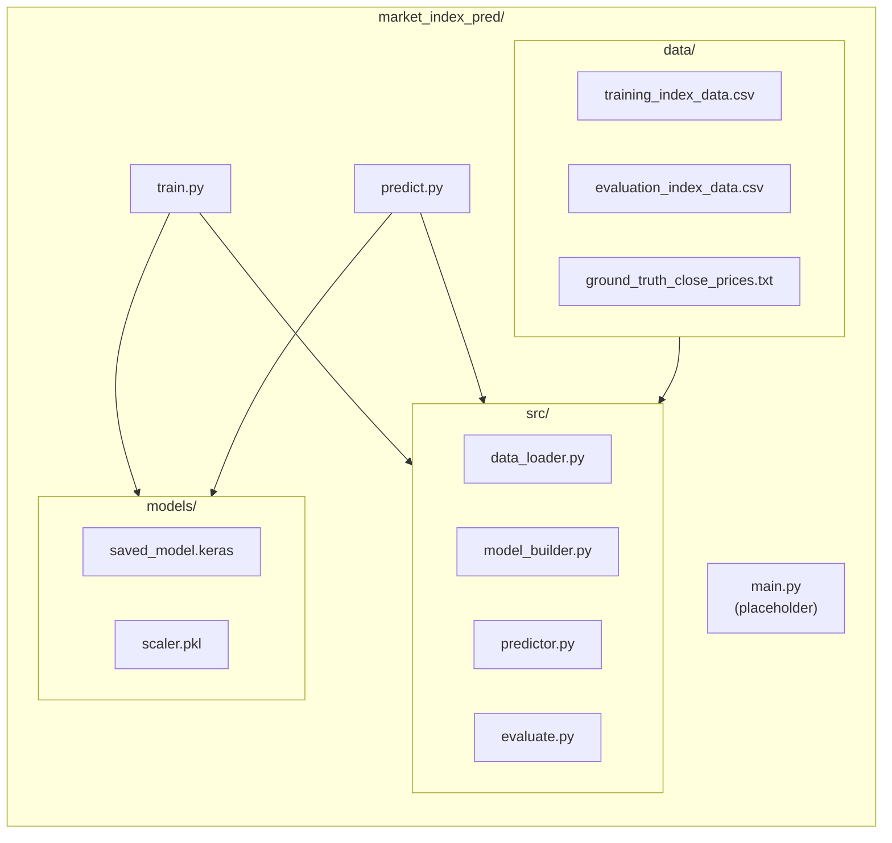
```mermaid
flowchart LR
    subgraph ROOT["market_index_pred/"]
        direction TB
        T["train.py"]
        P["predict.py"]
        M["main.py<br/>(placeholder)"]

        subgraph SRC["src/"]
            D["data_loader.py"]
            B["model_builder.py"]
            R["predictor.py"]
            E["evaluate.py"]
        end

        subgraph DATA_DIR["data/"]
            TC["training_index_data.csv"]
            EC["evaluation_index_data.csv"]
            GT2["ground_truth_close_prices.txt"]
        end

        subgraph MODELS["models/"]
            SM["saved_model.keras"]
            SP["scaler.pkl"]
        end
    end

    T --> SRC
    P --> SRC
    T --> MODELS
    P --> MODELS
    DATA_DIR --> SRC
```

---

## 3. Training Pipeline

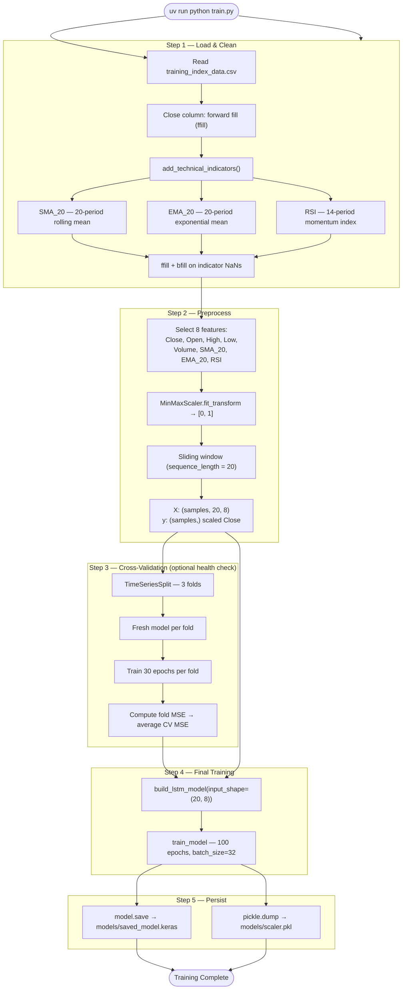
```mermaid
flowchart TD
    START(["uv run python train.py"]) --> LOAD

    subgraph LOAD["Step 1 — Load & Clean"]
        CSV["Read training_index_data.csv"]
        FFILL["Close column: forward fill (ffill)"]
        IND["add_technical_indicators()"]
        SMA["SMA_20 — 20-period rolling mean"]
        EMA["EMA_20 — 20-period exponential mean"]
        RSI["RSI — 14-period momentum index"]
        FILL2["ffill + bfill on indicator NaNs"]
    end

    subgraph PREP["Step 2 — Preprocess"]
        FEAT["Select 8 features:<br/>Close, Open, High, Low,<br/>Volume, SMA_20, EMA_20, RSI"]
        SCALE["MinMaxScaler.fit_transform → [0, 1]"]
        WINDOW["Sliding window (sequence_length = 20)"]
        XY["X: (samples, 20, 8)<br/>y: (samples,) scaled Close"]
    end

    subgraph CV["Step 3 — Cross-Validation (optional health check)"]
        TSCV["TimeSeriesSplit — 3 folds"]
        FRESH["Fresh model per fold"]
        CVTRAIN["Train 30 epochs per fold"]
        CVMSE["Compute fold MSE → average CV MSE"]
    end

    subgraph TRAIN["Step 4 — Final Training"]
        BUILD["build_lstm_model(input_shape=(20, 8))"]
        FIT["train_model — 100 epochs, batch_size=32"]
    end

    subgraph SAVE["Step 5 — Persist"]
        SAVE_MODEL["model.save → models/saved_model.keras"]
        SAVE_SCALER["pickle.dump → models/scaler.pkl"]
    end

    END(["Training Complete"])

    START --> CSV
    CSV --> FFILL --> IND
    IND --> SMA & EMA & RSI
    SMA & EMA & RSI --> FILL2
    FILL2 --> FEAT --> SCALE --> WINDOW --> XY

    XY --> TSCV --> FRESH --> CVTRAIN --> CVMSE
    CVMSE --> BUILD --> FIT
    XY --> BUILD
    FIT --> SAVE_MODEL & SAVE_SCALER
    SAVE_MODEL & SAVE_SCALER --> END
```

---

## 4. Evaluation / Inference Pipeline

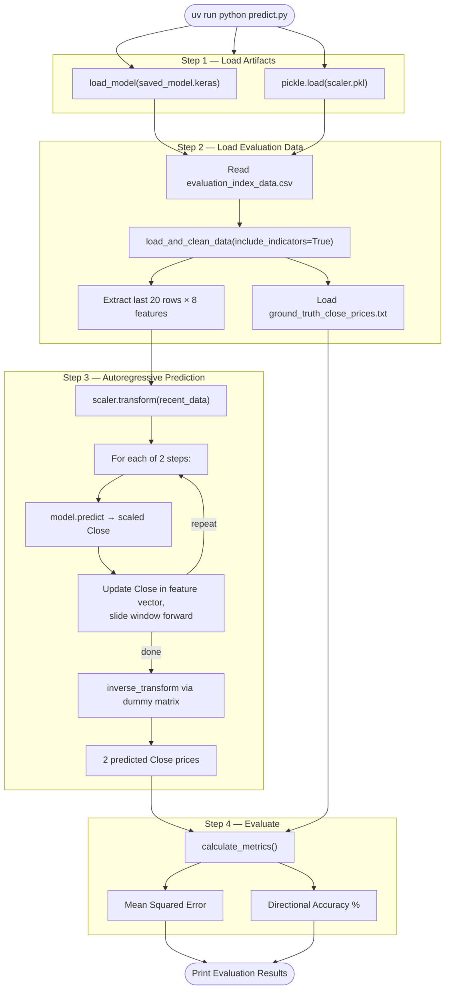
```mermaid
flowchart TD
    START(["uv run python predict.py"]) --> LOAD_ART

    subgraph LOAD_ART["Step 1 — Load Artifacts"]
        LM["load_model(saved_model.keras)"]
        LS["pickle.load(scaler.pkl)"]
    end

    subgraph LOAD_DATA["Step 2 — Load Evaluation Data"]
        ECSV["Read evaluation_index_data.csv"]
        ECLEAN["load_and_clean_data(include_indicators=True)"]
        GT["Load ground_truth_close_prices.txt"]
        RECENT["Extract last 20 rows × 8 features"]
    end

    subgraph INFER["Step 3 — Autoregressive Prediction"]
        TRANS["scaler.transform(recent_data)"]
        LOOP["For each of 2 steps:"]
        PRED["model.predict → scaled Close"]
        SLIDE["Update Close in feature vector,<br/>slide window forward"]
        INV["inverse_transform via dummy matrix"]
        OUT["2 predicted Close prices"]
    end

    subgraph MET["Step 4 — Evaluate"]
        CM["calculate_metrics()"]
        MSE["Mean Squared Error"]
        DA["Directional Accuracy %"]
    end

    RESULT(["Print Evaluation Results"])

    START --> LM & LS
    LM & LS --> ECSV
    ECSV --> ECLEAN --> RECENT
    ECLEAN --> GT
    RECENT --> TRANS --> LOOP
    LOOP --> PRED --> SLIDE
    SLIDE -->|repeat| LOOP
    SLIDE -->|done| INV --> OUT
    OUT --> CM
    GT --> CM
    CM --> MSE & DA --> RESULT
```

---

## 5. Component Responsibilities

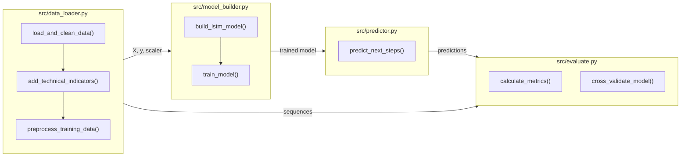
```mermaid
flowchart LR
    subgraph data_loader["src/data_loader.py"]
        direction TB
        L1["load_and_clean_data()"]
        L2["add_technical_indicators()"]
        L3["preprocess_training_data()"]
        L1 --> L2
        L2 --> L3
    end

    subgraph model_builder["src/model_builder.py"]
        direction TB
        M1["build_lstm_model()"]
        M2["train_model()"]
        M1 --> M2
    end

    subgraph predictor["src/predictor.py"]
        direction TB
        P1["predict_next_steps()"]
    end

    subgraph evaluate["src/evaluate.py"]
        direction TB
        E1["calculate_metrics()"]
        E2["cross_validate_model()"]
    end

    data_loader -->|"X, y, scaler"| model_builder
    model_builder -->|"trained model"| predictor
    predictor -->|"predictions"| evaluate
    data_loader -->|"sequences"| evaluate
```

| Module | Function | Responsibility |
|--------|----------|----------------|
| `data_loader.py` | `load_and_clean_data` | CSV ingestion, NaN handling via `ffill` |
| `data_loader.py` | `add_technical_indicators` | Compute SMA_20, EMA_20, RSI |
| `data_loader.py` | `preprocess_training_data` | MinMaxScaler fit, sliding-window sequences |
| `model_builder.py` | `build_lstm_model` | Define stacked LSTM + Dropout + Dense |
| `model_builder.py` | `train_model` | Fit model with Adam / MSE |
| `predictor.py` | `predict_next_steps` | Multi-step autoregressive forecasting |
| `evaluate.py` | `calculate_metrics` | MSE and directional accuracy |
| `evaluate.py` | `cross_validate_model` | Walk-forward TimeSeriesSplit CV |

---

## 6. LSTM Neural Network Architecture

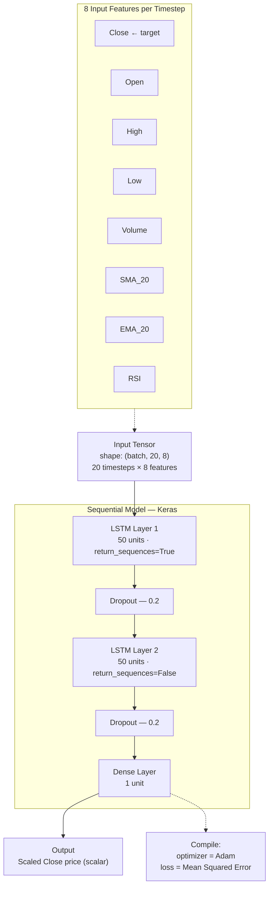
```mermaid
flowchart TD
    INPUT["Input Tensor<br/>shape: (batch, 20, 8)<br/>20 timesteps × 8 features"]

    subgraph LSTM_STACK["Sequential Model — Keras"]
        L1["LSTM Layer 1<br/>50 units · return_sequences=True"]
        D1["Dropout — 0.2"]
        L2["LSTM Layer 2<br/>50 units · return_sequences=False"]
        D2["Dropout — 0.2"]
        DENSE["Dense Layer<br/>1 unit"]
    end

    OUTPUT["Output<br/>Scaled Close price (scalar)"]

    COMPILE["Compile:<br/>optimizer = Adam<br/>loss = Mean Squared Error"]

    INPUT --> L1 --> D1 --> L2 --> D2 --> DENSE --> OUTPUT
    DENSE -.-> COMPILE

    subgraph FEATURES["8 Input Features per Timestep"]
        F1["Close ← target"]
        F2["Open"]
        F3["High"]
        F4["Low"]
        F5["Volume"]
        F6["SMA_20"]
        F7["EMA_20"]
        F8["RSI"]
    end

    FEATURES -.-> INPUT
```

---

## 7. Sliding Window — Supervised Learning Transform

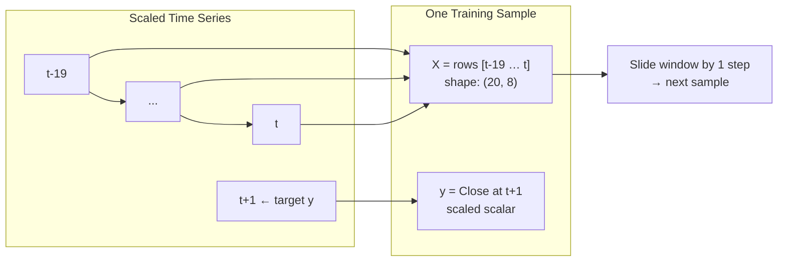
```mermaid
flowchart LR
    subgraph RAW["Scaled Time Series"]
        T1["t-19"] --> T2["..."] --> T20["t"]
        T21["t+1 ← target y"]
    end

    subgraph WINDOW["One Training Sample"]
        XWIN["X = rows [t-19 … t]<br/>shape: (20, 8)"]
        YVAL["y = Close at t+1<br/>scaled scalar"]
    end

    SLIDE["Slide window by 1 step<br/>→ next sample"]

    T1 & T2 & T20 --> XWIN
    T21 --> YVAL
    XWIN --> SLIDE
```

---

## 8. Autoregressive Prediction Loop

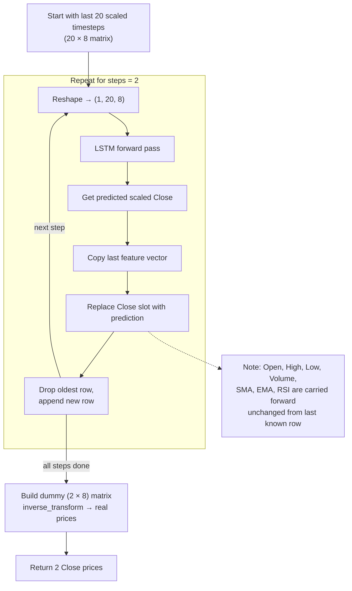
```mermaid
flowchart TD
    INIT["Start with last 20 scaled timesteps<br/>(20 × 8 matrix)"]

    subgraph STEP["Repeat for steps = 2"]
        RESHAPE["Reshape → (1, 20, 8)"]
        FORWARD["LSTM forward pass"]
        PRED["Get predicted scaled Close"]
        COPY["Copy last feature vector"]
        REPLACE["Replace Close slot with prediction"]
        CONCAT["Drop oldest row,<br/>append new row"]
    end

    INV["Build dummy (2 × 8) matrix<br/>inverse_transform → real prices"]

    DONE["Return 2 Close prices"]

    INIT --> RESHAPE --> FORWARD --> PRED --> COPY --> REPLACE --> CONCAT
    CONCAT -->|next step| RESHAPE
    CONCAT -->|all steps done| INV --> DONE

    NOTE["Note: Open, High, Low, Volume,<br/>SMA, EMA, RSI are carried forward<br/>unchanged from last known row"]
    REPLACE -.-> NOTE
```

---

## 9. Cross-Validation Strategy

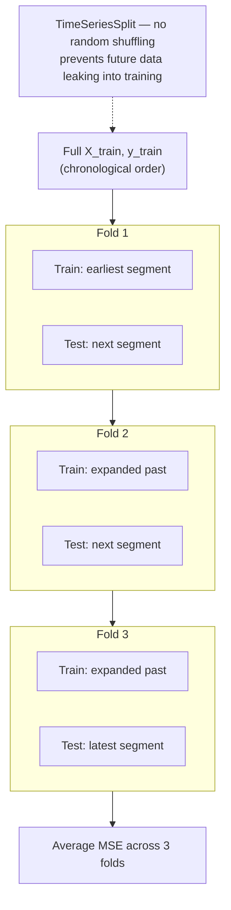
```mermaid
flowchart TD
    DATA["Full X_train, y_train<br/>(chronological order)"]

    subgraph FOLD1["Fold 1"]
        T1["Train: earliest segment"]
        V1["Test: next segment"]
    end

    subgraph FOLD2["Fold 2"]
        T2["Train: expanded past"]
        V2["Test: next segment"]
    end

    subgraph FOLD3["Fold 3"]
        T3["Train: expanded past"]
        V3["Test: latest segment"]
    end

    AVG["Average MSE across 3 folds"]

    DATA --> FOLD1 --> FOLD2 --> FOLD3 --> AVG

    RULE["TimeSeriesSplit — no random shuffling<br/>prevents future data leaking into training"]
    RULE -.-> DATA
```

---

## 10. End-to-End Data Flow

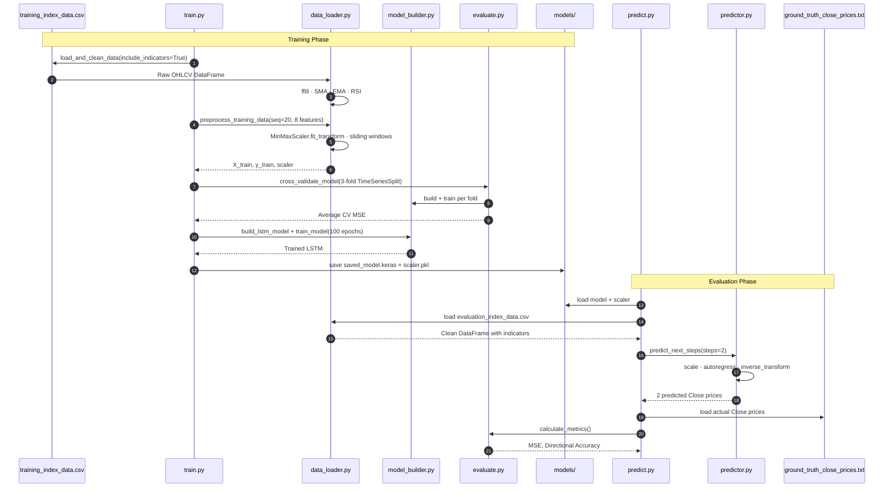
```mermaid
sequenceDiagram
    autonumber
    participant CSV as training_index_data.csv
    participant Train as train.py
    participant DL as data_loader.py
    participant MB as model_builder.py
    participant EV as evaluate.py
    participant Disk as models/
    participant Pred as predict.py
    participant PR as predictor.py
    participant GT as ground_truth_close_prices.txt

    Note over CSV,Disk: Training Phase
    Train->>CSV: load_and_clean_data(include_indicators=True)
    CSV->>DL: Raw OHLCV DataFrame
    DL->>DL: ffill · SMA · EMA · RSI
    Train->>DL: preprocess_training_data(seq=20, 8 features)
    DL->>DL: MinMaxScaler.fit_transform · sliding windows
    DL-->>Train: X_train, y_train, scaler
    Train->>EV: cross_validate_model(3-fold TimeSeriesSplit)
    EV->>MB: build + train per fold
    EV-->>Train: Average CV MSE
    Train->>MB: build_lstm_model + train_model(100 epochs)
    MB-->>Train: Trained LSTM
    Train->>Disk: save saved_model.keras + scaler.pkl

    Note over Pred,GT: Evaluation Phase
    Pred->>Disk: load model + scaler
    Pred->>DL: load evaluation_index_data.csv
    DL-->>Pred: Clean DataFrame with indicators
    Pred->>PR: predict_next_steps(steps=2)
    PR->>PR: scale · autoregress · inverse_transform
    PR-->>Pred: 2 predicted Close prices
    Pred->>GT: load actual Close prices
    Pred->>EV: calculate_metrics()
    EV-->>Pred: MSE, Directional Accuracy
```

---

## 11. Technology Dependencies

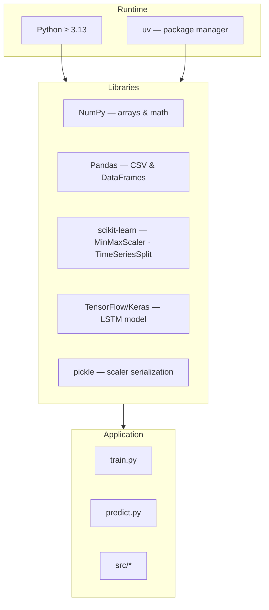
```mermaid
flowchart TB
    subgraph RUNTIME["Runtime"]
        PY["Python ≥ 3.13"]
        UV["uv — package manager"]
    end

    subgraph LIBS["Libraries"]
        NP["NumPy — arrays & math"]
        PD["Pandas — CSV & DataFrames"]
        SK["scikit-learn — MinMaxScaler · TimeSeriesSplit"]
        TF["TensorFlow/Keras — LSTM model"]
        PK["pickle — scaler serialization"]
    end

    subgraph APP["Application"]
        TRAIN["train.py"]
        PRED["predict.py"]
        SRC["src/*"]
    end

    PY --> LIBS
    UV --> LIBS
    LIBS --> APP
```

---

## Execution Commands

```bash
# Train model and save artifacts
uv run python train.py

# Evaluate predictions against ground truth
uv run python predict.py
```
